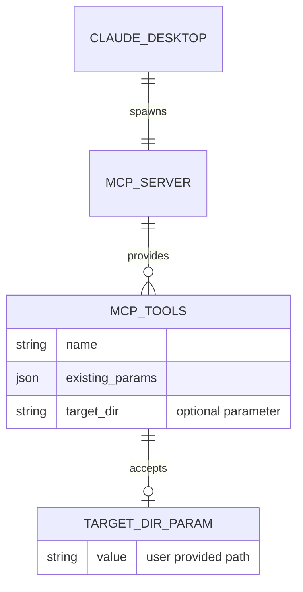

# Dynamic Target Directory Solution for CodeContext MCP

## Executive Summary

This document outlines a simple, elegant solution for making CodeContext MCP work with multiple projects without requiring configuration file changes. The solution adds an optional `target_dir` parameter to all tools, allowing users to specify project paths in conversation with Claude rather than editing JSON configurations.

**Key Benefits:**
- ✅ Zero configuration changes required
- ✅ 30 minutes implementation time
- ✅ Works with existing Claude Desktop setups
- ✅ Supports multi-project analysis
- ✅ No over-engineering or complex state management

## Problem Statement

### Current Pain Point
Users must hardcode project paths in Claude Desktop configuration:

```json
{
  "mcpServers": {
    "codecontext": {
      "command": "codecontext",
      "args": ["mcp", "--target", "/Users/user/Documents/project"]
    }
  }
}
```

**Issues:**
- Requires JSON editing for each project
- No multi-project support
- Configuration becomes stale when projects move
- Poor user experience for project switching

### User Impact
- 🔧 **Configuration burden**: Manual JSON editing for each project
- 🔒 **Single project limitation**: Can only analyze one project per MCP server
- ⏱️ **Switching friction**: Must restart Claude Desktop to change projects
- 🤔 **Technical barrier**: Non-technical users struggle with file paths

## The Simple Solution

### Core Concept
Add an optional `target_dir` parameter to all MCP tools, allowing Claude to specify the target directory dynamically.

### Architecture


### Implementation Overview
1. Add `target_dir` field to all tool argument structs
2. Update tool handlers to use the parameter when provided
3. Implement path expansion (e.g., `~` to home directory)
4. Update tool descriptions to document the new parameter

**Total effort**: ~30 minutes of development time

## User Experience Transformation

### Before (Current State)
```
# Configuration required
{
  "codecontext": {
    "args": ["mcp", "--target", "/full/path/to/project"]
  }
}

# Conversation
User: "Analyze my codebase"
Claude: [analyzes hardcoded project]

User: "Now analyze my other project"
Claude: "I can only analyze the configured project. Please update your configuration."
```

### After (With Dynamic Target)
```json
{
  "codecontext": {
    "command": "codecontext",
    "args": ["mcp"]
  }
}
```

```
# Conversation
User: "Analyze ~/code/my-react-app"
Claude: [analyzes React app]

User: "Now compare it with ~/code/my-vue-app"
Claude: [analyzes Vue app and compares]

User: "Check the tests in the React project"
Claude: [analyzes React project tests]
```

## Implementation Guide

### Step 1: Update Tool Argument Structs

```go
// Before
type GetCodebaseOverviewArgs struct {
    IncludeStats bool `json:"include_stats"`
}

// After
type GetCodebaseOverviewArgs struct {
    IncludeStats bool   `json:"include_stats"`
    TargetDir    string `json:"target_dir,omitempty"`
}
```

Apply this pattern to all tool argument structs:
- `GetCodebaseOverviewArgs`
- `GetFileAnalysisArgs`
- `GetSymbolInfoArgs`
- `SearchSymbolsArgs`
- `GetDependenciesArgs`
- `GetSemanticNeighborhoodsArgs`
- `GetFrameworkAnalysisArgs`

### Step 2: Update Tool Handlers

```go
func (s *CodeContextMCPServer) getCodebaseOverview(args GetCodebaseOverviewArgs) (*mcp.CallToolResult, error) {
    // Resolve target directory
    targetDir := s.resolveTargetDir(args.TargetDir)
    
    // Use targetDir for analysis instead of s.config.TargetDir
    graph, err := s.analyzer.AnalyzeDirectory(targetDir)
    if err != nil {
        return nil, fmt.Errorf("failed to analyze directory %s: %w", targetDir, err)
    }
    
    // Rest of the function remains the same
}
```

### Step 3: Implement Path Resolution

```go
func (s *CodeContextMCPServer) resolveTargetDir(targetDir string) string {
    // If target_dir parameter provided, use it
    if targetDir != "" {
        return expandPath(targetDir)
    }
    
    // Fallback to configured target directory
    return s.config.TargetDir
}

func expandPath(path string) string {
    if strings.HasPrefix(path, "~/") {
        home, _ := os.UserHomeDir()
        return filepath.Join(home, path[2:])
    }
    return path
}
```

### Step 4: Update Tool Descriptions

```go
&mcp.Tool{
    Name: "get_codebase_overview",
    Description: `Get comprehensive overview of a codebase.
    
    Parameters:
    - include_stats: Include detailed statistics (optional)
    - target_dir: Directory to analyze (optional). Supports:
      * Absolute paths: /Users/john/code/project
      * Home-relative: ~/code/project
      * If not specified, uses configured default directory`,
}
```

## Supported Path Formats

### Absolute Paths
```
/Users/john/Documents/code/my-project
/home/user/projects/web-app
C:\Users\John\Code\MyProject
```

### Home-Relative Paths
```
~/code/my-project
~/Documents/projects/web-app
```

### Relative Paths (Future Enhancement)
```
../other-project
./current-project
```

## Example Usage Scenarios

### Single Project Analysis
```
User: "Give me an overview of ~/code/codecontext"
Claude: [calls get_codebase_overview with target_dir="~/code/codecontext"]
```

### Multi-Project Comparison
```
User: "Compare the authentication systems in ~/code/frontend and ~/code/backend"
Claude: 
1. [calls get_file_analysis with target_dir="~/code/frontend", searches for auth files]
2. [calls get_file_analysis with target_dir="~/code/backend", searches for auth files]
3. [provides comparison]
```

### Framework Analysis
```
User: "Analyze the React components in ~/code/my-react-app"
Claude: [calls get_framework_analysis with target_dir="~/code/my-react-app", framework="React"]
```

## Migration Guide

### For Existing Users

#### Current Configuration
```json
{
  "mcpServers": {
    "codecontext": {
      "command": "codecontext",
      "args": ["mcp", "--target", "/Users/user/code/main-project"]
    }
  }
}
```

#### Updated Configuration
```json
{
  "mcpServers": {
    "codecontext": {
      "command": "codecontext",
      "args": ["mcp", "--target", "/Users/user/code/main-project"]
    }
  }
}
```

**Note**: Existing configurations continue to work as before. The `--target` flag provides the default directory when no `target_dir` parameter is specified.

#### Gradual Migration
1. **Keep existing config**: No immediate changes required
2. **Test new feature**: Try specifying different directories in conversation
3. **Simplify config**: Eventually remove `--target` flag if desired

### For New Users

#### Minimal Configuration
```json
{
  "mcpServers": {
    "codecontext": {
      "command": "codecontext",
      "args": ["mcp"]
    }
  }
}
```

Users specify target directories in conversation with Claude.

## Technical Details

### Error Handling
```go
func (s *CodeContextMCPServer) resolveTargetDir(targetDir string) (string, error) {
    resolved := targetDir
    if targetDir != "" {
        resolved = expandPath(targetDir)
    } else {
        resolved = s.config.TargetDir
    }
    
    // Validate directory exists and is accessible
    if _, err := os.Stat(resolved); os.IsNotExist(err) {
        return "", fmt.Errorf("directory does not exist: %s", resolved)
    }
    
    return resolved, nil
}
```

### Performance Considerations
- **No caching needed**: Each tool call is independent
- **No session state**: Stateless design prevents complexity
- **Path resolution cost**: Negligible (~1ms per call)

### Security Considerations
- **Path traversal protection**: Validate resolved paths
- **Access control**: Respect file system permissions
- **No arbitrary execution**: Only directory analysis, no code execution

## Frequently Asked Questions

### Q: Do I need to restart Claude Desktop after implementing this?
**A**: No, this is a server-side change. The MCP server will be restarted automatically when you update the binary.

### Q: Will this break existing configurations?
**A**: No, existing `--target` configurations continue to work as before. The new parameter is additive.

### Q: Can I analyze remote repositories?
**A**: Not directly. The tool requires local directories. You would need to clone remote repositories first.

### Q: How does this compare to complex workspace management?
**A**: This solution is intentionally simple. It solves the core problem (avoiding JSON configuration edits) without introducing complex state management, caching, or discovery systems.

### Q: What if the directory doesn't exist?
**A**: The tool will return a clear error message indicating the directory was not found.

### Q: Can I use environment variables in paths?
**A**: Currently only `~` expansion is supported. Environment variable expansion could be added as a future enhancement.

## Testing Strategy

### Unit Tests
```go
func TestResolveTargetDir(t *testing.T) {
    tests := []struct {
        name     string
        input    string
        expected string
    }{
        {"absolute_path", "/tmp/test", "/tmp/test"},
        {"home_relative", "~/code", "/Users/testuser/code"},
        {"empty_uses_default", "", "/default/path"},
    }
    
    for _, tt := range tests {
        t.Run(tt.name, func(t *testing.T) {
            result := resolveTargetDir(tt.input)
            assert.Equal(t, tt.expected, result)
        })
    }
}
```

### Integration Tests
```go
func TestGetCodebaseOverviewWithTargetDir(t *testing.T) {
    tempDir := t.TempDir()
    createTestProject(tempDir)
    
    args := GetCodebaseOverviewArgs{
        IncludeStats: true,
        TargetDir:    tempDir,
    }
    
    result, err := server.getCodebaseOverview(args)
    assert.NoError(t, err)
    assert.Contains(t, result.Content, "Files Analyzed")
}
```

## Future Enhancements (Optional)

### Environment Variable Expansion
```go
func expandPath(path string) string {
    if strings.HasPrefix(path, "~/") {
        home, _ := os.UserHomeDir()
        return filepath.Join(home, path[2:])
    }
    
    // Expand environment variables
    return os.ExpandEnv(path)
}
```

### Recent Projects Memory (If Needed)
```go
type RecentProjects struct {
    paths []string
    mutex sync.RWMutex
}

func (rp *RecentProjects) Add(path string) {
    rp.mutex.Lock()
    defer rp.mutex.Unlock()
    
    // Add to front, keep last 10
    rp.paths = append([]string{path}, rp.paths...)
    if len(rp.paths) > 10 {
        rp.paths = rp.paths[:10]
    }
}
```

## Conclusion

This simple solution transforms CodeContext from a single-project tool into a flexible multi-project analyzer without introducing complexity or over-engineering. By adding one optional parameter to each tool, we solve the core user problem while maintaining the performance and reliability characteristics that make CodeContext unique.

The solution follows the principle of "simplest thing that could possibly work" while leaving room for future enhancements based on actual user feedback rather than anticipated needs.

---

*Implementation time: ~30 minutes*  
*Maintenance burden: Minimal*  
*User impact: Significant improvement*  
*Over-engineering risk: None*